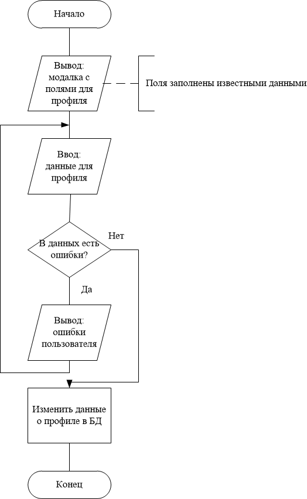

# FUNC-PLAYER-PROFILE-UPDATE-001

# 1. Описание

Функция позволяет пользователю редактировать свой профиль.

# 2. Функциональное поведение

## Что должен делать пользователь

-

## Что может делать пользователь

- Пользователь может ввести следующие данные:
  - Файл нового аватара
  - Никнейм профиля телеграм или ссылка на него
  - Основная роль в команде
  - Промежуток времени, когда пользователь активен
- Пользователь может менять любые сохраненные данные.

## Что должна делать система

- Система должна определить профиль авторизованного пользователя.
- Система должна обработать входные данные.
- Система должна загрузить файл аватара и получить ссылку на него.
- Система должна обновить данные о профиле, если входные данные корректны.
- Система должна подсвечивать пользователю ошибки во входных данных.

# 3. Когда выполняется

Пользователь нажимает кнопку "Редактировать профиль".

# 4. Предусловия

- Пользователь авторизован.
  
# 5. Алгоритм

# 6. Результат выполнения

Успешное выполнение:

- Система обновила данные о профиле.

Неуспешное выполнение:

- Система возвращает ошибку валидации или внутреннюю ошибку.

# 7. Критерии приемки

В критериях приемки оставлены только те сценарии, которые отражают поведение, реализуемое разработчиком. Клиентские ошибки, автоматические ошибки сервера и внутренние технические сбои, не требующие отдельной ручной обработки, в критерии не включены.

- Успешное изменение данных о профиле только с необходимыми полями.
- Успешное изменение данных о профиле со всеми заполненными полями.
- Успешное удаление прайм-тайма.
- Неуспешное изменение данных о профиле при некоторых пустых необходимых полях.
- Неуспешное изменение данных о профиле при некорректных данных в полях.
